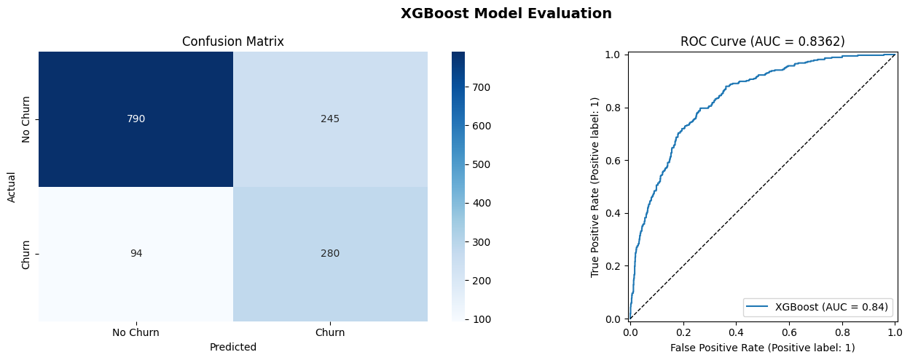
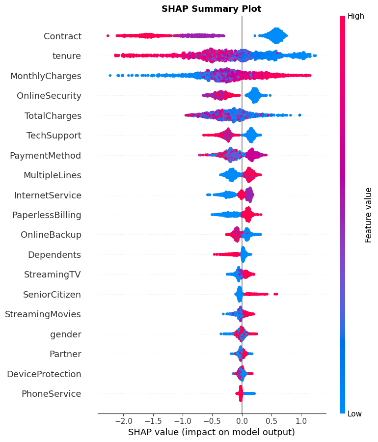
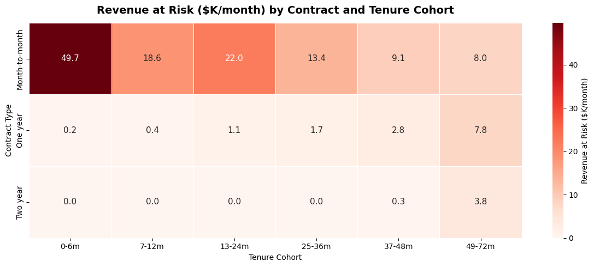

# Customer Churn Prediction

End-to-end machine learning pipeline to predict telecom customer churn using the IBM Telco Customer Churn dataset. Covers exploratory analysis, XGBoost classification, SHAP explainability, and cohort-level revenue at risk analysis.

## Project Structure

```
customer-churn-prediction/
├── notebooks/
│   ├── 01_eda.ipynb
│   ├── 02_model.ipynb
│   ├── 03_shap.ipynb
│   └── 04_cohort.ipynb
├── visuals/
├── results/
│   └── metrics.json
└── requirements.txt
```

## Results

| Metric | Score |
|---|---|
| Accuracy | 0.7566 |
| F1 (weighted) | 0.7677 |
| ROC-AUC | 0.8376 |
| CV ROC-AUC (5-fold) | 0.8384 ± 0.0113 |

On the churn class the model runs at 0.75 recall and 0.53 precision on the 1,409 held-out
customers, so it finds three in four churners at the cost of roughly one false alarm per real
one. For a retention call list that is usually the right side of the trade.



## What drives churn

Overall churn is 26.5%. Contract type dominates everything else: month-to-month customers churn
at 42.7%, two-year customers at 2.8%. Customers who left had been around 18.0 months on average
against 37.6 for those who stayed, and paid $74.44 a month against $61.27.

SHAP ranks contract first and tenure second, the same order the exploratory analysis suggested
before any model was fitted.



## Where the lost revenue sits

Cutting customers by contract and tenure cohort and summing the monthly charges of the ones who
actually churned gives $139,131 a month. The largest single block is month-to-month customers in
their first six months: 1,413 customers, 55.2% of them gone, $49,681 a month. Two-year contracts
barely register in any cohort, which says the contract is doing retention work a model cannot.



## How to Run

```bash
git clone https://github.com/JAYANSHUBADLANI/customer-churn-prediction.git
cd customer-churn-prediction
pip install -r requirements.txt
jupyter notebook
```

Run notebooks in order: `01_eda` → `02_model` → `03_shap` → `04_cohort`. Plots save to `/visuals`, metrics to `/results/metrics.json`.

## Dataset

[IBM Telco Customer Churn](https://www.kaggle.com/datasets/blastchar/telco-customer-churn): 7,043 customers, 21 features. Target variable: `Churn` (Yes/No).

**Author:** Jayanshu Badlani | [GitHub](https://github.com/JAYANSHUBADLANI) | [LinkedIn](https://www.linkedin.com/in/jayanshu-badlani-b77478185)
